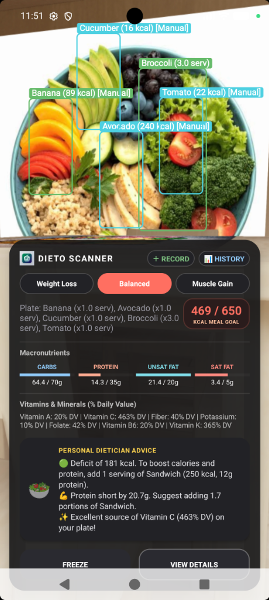

# Dieto - Real-Time Smart Diet Scanner

**Dieto** is a premium, state-of-the-art Android application designed to track and manage nutrition dynamically. Using advanced computer vision and on-device machine learning, Dieto analyzes meal plates in real time, automatically estimates portions, scales macronutrients/micronutrients, and delivers personalized dietician advice.

---

## Key Features

1. **Dual Machine Learning Engine**:
   - **YOLOv8 Object Detector**: Real-time bounding box segmentations and food class identification (utilizing a high-performance quantized `yolov8n.onnx` model running locally).
   - **Google ML Kit OCR (Text Recognition)**: A synchronous background text recognition pipeline processing at 1 FPS that reads packaging covers (e.g., Milk, Eggs) and extracts nutrition panels dynamically to register custom scanned items.

2. **Dynamic Portion Size Scaling**:
   - Portions are estimated dynamically based on the ratio between the detected bounding box area and standard reference areas for specific foods.
   - All calories and macronutrients (Carbs, Protein, Unsaturated/Saturated Fats) are scaled proportionally in real time.

3. **Decoupled Configuration (`foods.json`)**:
   - The registry is completely decoupled from the Java codebase. The default 20 foods, their serving descriptions, macro distributions, and vitamins/minerals are loaded dynamically from an offline JSON config asset on startup.

4. **Personal Dietician Advice System**:
   - Evaluates active plate macros against custom diet profiles (**Weight Loss**, **Balanced**, **Muscle Gain**).
   - Dynamically prints color-coded, itemized dietary advice, warnings, and suggestions.

5. **Unified Meal Logger & Daily History**:
   - Compiles both visual detections, OCR scans, and manual annotations into a consolidated consensus map.
   - Commits records to persistent local storage and tracks daily cumulative intake.

---

## Real-Time Testing & Verification Evidence

Here is the live evidence demonstrating the real-time scanning page:
- Multiple manual annotations (Banana, Cucumber, Tomato, Avocado) layered with real-time YOLOv8 detections (Broccoli).
- Automated calorie calculation scaled up to `469 / 650 kcal`.
- Dynamic dietician suggestions updating according to the active plate metrics.



---

## Setup & Running Instructions

### Prerequisites
- Android Studio Ladybug (or newer)
- Android SDK 34 (Upside Down Cake)
- Gradle 8.0+

### Building the Project
Clone the repository, import the directory into Android Studio, and compile using the Gradle wrapper:
```bash
# Compile debug APK
./gradlew assembleDebug
```

### Deploying to Emulator/Device
Ensure your target device is connected via ADB, then run:
```bash
# Install on connected device/emulator
./gradlew installDebug
```

---

## Architecture details
- **Frontend / UI**: ConstraintLayout with premium glassmorphic bottom cards, custom progress indicators, and dynamic overlay drawing.
- **Image Analyzer**: Android CameraX pipeline processing frames at 1 FPS to prevent battery drain and UI lag while maintaining responsive visual tracking.
- **ML Inference**: `org.tensorflow.lite:tensorflow-lite-support` and `com.google.android.gms:play-services-mlkit-text-recognition`.
